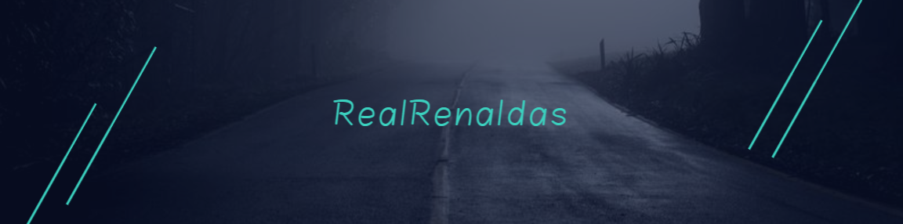

<h1 align="center">Hello, my name is Renaldas</h1>

<!--
**renaldas112/renaldas112** is a ✨ _special_ ✨ repository because its `README.md` (this file) appears on your GitHub profile.
Here are some ideas to get you started: -->

  
  

  

## 👨🏻‍💻 About Me:

<!-- - 🙋‍♂️ All about me is at **[My Website](-url-to-my-website-/)** -->
🔭 Currently working on my personal `Portfolio` using `React.js`.

🌱 Student in `CodeAcademy`

⚡ Games I play: Apex Legends, League of Legends

## 🛠️ Technologies and Tools I use:

  

## You can find me here:

   
   
  

##  Support me

   

## 📊 My GitHub Data:

  
  

 
